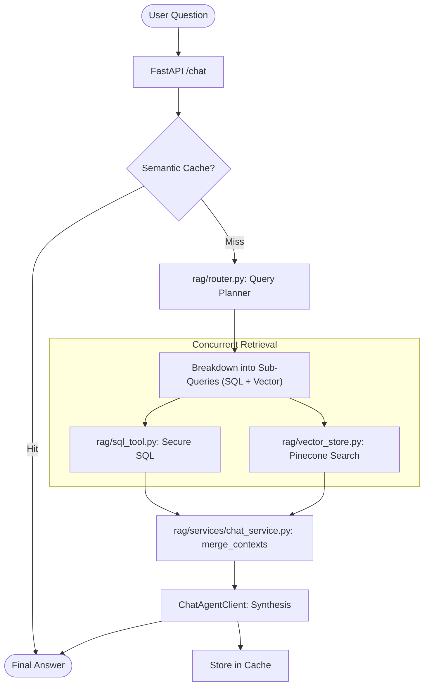

# 🗺️ Codebase Map: AI Investment Intelligence Engine

This document provides a structural overview of the project, detailing the role of each directory and file in the overall Investment Intelligence workflow.

---

## 🏗️ Architectural Layers

The system is organized into four primary layers, ensuring a strict **Separation of Concerns**:

1.  **Core Layer (`core/`)**: The foundation. Handles connections, security, logging, caching, and fundamental LLM interactions.
2.  **RAG Layer (`rag/`)**: High-level intelligence. Manages query routing, vector searching, SQL tool execution, and context synthesis.
3.  **Financial Layer (`financial/`)**: Data ingestion. Contains providers (FX, FRED, Yahoo) and logic for populating the structured database.
4.  **Document Layer (`documents/`)**: Binary handling. Manages PDF uploads and coordinates with the worker for async indexing.

---

## 📂 Directory & File Breakdown

### 🛠️ `core/` — Infrastructure & Foundation
| File | Role | Flow Role |
| :--- | :--- | :--- |
| `connections.py` | Lifecycle management for Redis, Postgres, Pinecone, and ML models. | **Init**: Loads models & pools on startup. |
| `cache.py` | Implementation of Exact-Match, Embedding, and **Semantic Caching**. | **Lookup**: Intercepts requests to bypass LLM/DB. |
| `llm_client.py` | Unified interface for OpenAI/LLM calls (Sync, Stream, JSON). | **API**: Handles all outgoing AI requests. |
| `logger.py` | Structured JSON logging with Correlation IDs and `@trace_latency`. | **Auditing**: Records every event for tracing. |
| `security.py` | PII filtering and prompt injection guardrails. | **Guard**: Cleans input/output data. |
| `config.py` | Environment variable management and global constants. | **Shared**: System configuration. |

### 🧠 `rag/` — Intelligence & Retrieval
| File | Role | Flow Role |
| :--- | :--- | :--- |
| `router.py` | **Query Planner**. Decomposes user questions into `MultiQueryPlan`. | **Orchestrate**: First step of the logic flow. |
| `sql_tool.py` | **Secure SQL Engine**. Executes read-only queries with strict table allowlists. | **Data**: Pulls structured financial data. |
| `services/chat_service.py` | The "Brain". Coordinates concurrent retrieval, merging, and synthesis. | **Logic**: Core of the `/chat` endpoint. |
| `vector_store.py` | Pinecone abstraction for semantic search and metadata filtering. | **Search**: Pulls unstructured document context. |
| `rerank_model.py` | Cross-encoder logic to rank retrieved chunks by relevance. | **Refine**: Improves precision of retrieval. |
| `schemas.py` | Pydantic models (contract) for queries, plans, and responses. | **Contract**: Defines API input/output. |

### 📂 `documents/` — Document Lifecycle
| File | Role | Flow Role |
| :--- | :--- | :--- |
| `routes/upload.py` | API endpoint for PDF uploads; pushes tasks to Redis. | **Input**: Start of the document pipeline. |
| `routing.py` | Logic for routing queries to specific document context. | **Filter**: Ensures multi-tenant isolation. |

### 👷 Root Files
| File | Role |
| :--- | :--- |
| `main.py` | FastAPI application entry point; mounts routes and middleware. |
| `worker_entrypoint.py` | Background process handling PDF indexing and scheduled data ingestion (FX/Macro). |
| `schema.sql` | The single source of truth for the PostgreSQL database structure. |
| `docker-compose.yml` | Orchestrates Api, Worker, Postgres, Redis, and Nginx. |

---

## 🔄 The End-to-End Workflow (Stage 9)

---

## 🏁 Design Philosophy
*   **Separation of Concerns**: `chat_service.py` doesn't know *how* to write SQL; it asks `router.py`. `router.py` doesn't know *how* to execute; it delegates to `sql_tool.py`.
*   **Concurrency**: retrieval is done in parallel (`asyncio.gather`) so the total latency is determined by the slowest source, not the sum of all.
*   **Auditability**: Every step is traceable via `request_id` in the JSON logs.
